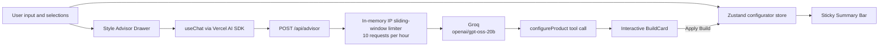

# StudioPick - AI Mechanical Keyboard Configurator

StudioPick is an AI-assisted mechanical keyboard configurator. Users choose a keyboard build, track the live price with Zustand, and ask an AI Style Advisor for a budget-aware recommendation that can be applied to the configurator in one click.

[](https://studiopick.vercel.app)


## Architecture and Data Flow



The browser owns interactive configuration state through Zustand. Pricing is derived from the product catalog, while the advisor route streams model output and exposes a structured `configureProduct` tool. A successful tool result becomes an interactive `BuildCard`; applying it hydrates the same Zustand state used by the configurator and summary bar.

## Features and Checkpoints

| Milestone | Delivered capability |
| --- | --- |
| FE-01 | Next.js App Router foundation and keyboard configurator surface. |
| FE-02 | Product catalog-driven layouts, cases, switches, keycaps, and add-ons. |
| FE-03 | Zustand state management for selections, cart state, advisor visibility, and reset behavior. |
| FE-04 | Dynamic pricing derived from base price, option deltas, and accessories. |
| FE-05 | Vercel AI SDK `useChat` streaming advisor drawer. |
| FE-06 | Groq-backed `/api/advisor` route with structured `configureProduct` tool-calling. |
| FE-07 | Budget-aware recommendations, including the low-budget minimum-build edge case. |
| FE-08 | Stream error handling, retry behavior, and resilient advisor UI states. |
| FE-09 | Vitest and React Testing Library coverage for pricing, Zustand actions, reset behavior, and BuildCard interactions. |
| FE-10 | WCAG-focused landmarks, live regions, accessible labels, visible focus rings, focus trapping, Escape handling, focus restoration, and lazy-loaded advisor UI. |
| FE-11 / Capstone | IP-based hourly rate limiting, production verification, deployment readiness, and publication-grade project documentation. |

## Local Setup

### Prerequisites

- Node.js 18 or newer
- npm 9 or newer
- A Groq API key

### Install

```bash
git clone https://github.com/AnzlaNazar/StudioPick.git
cd StudioPick
npm install
```

Create `.env.local` in the project root:

```env
GROQ_API_KEY=your_groq_api_key_here
```

Never commit `.env.local` or expose the API key in client-side code.

### Run Locally

```bash
npm run dev
```

Open [http://localhost:3000](http://localhost:3000).

### Test and Build

```bash
npm test
npm run test:watch
npm run build
```

## Rate Limiting

`POST /api/advisor` uses an in-memory sliding window keyed by the first address in `x-forwarded-for`, then `x-real-ip`, with an anonymous fallback. Each identifier may make 10 requests within 60 minutes. The eleventh request receives HTTP 429 with `Retry-After`, `X-RateLimit-Limit`, and `X-RateLimit-Remaining` headers.

This limiter is intentionally lightweight for the capstone and single-instance deployments. For a multi-region production deployment, replace the process-local map with a shared store such as Vercel KV or Upstash Redis.

## Screenshots and Demo

Add captured screenshots to `docs/screenshots/` using these names:

### Happy Path


### BuildCard Tool Generation


### Handled Error and Edge States


## Production Submission Checklist

Run the following from the project root:

```bash
# 1. Verify pricing, store, and component behavior
npm test

# 2. Verify the optimized production build
npm run build

# 3. Deploy the production build to Vercel
npx vercel --prod
```

Before submitting, confirm `GROQ_API_KEY` is configured in the Vercel project environment, open the deployed URL, send an advisor prompt, apply a generated build, and verify the rate-limit response contract through the API or deployment logs.

## Tech Stack

- Next.js 16 with App Router and TypeScript
- React 19
- Tailwind CSS v4
- Zustand
- Vercel AI SDK
- Groq `openai/gpt-oss-20b`
- Vitest, JSDOM, and React Testing Library

## License

See [LICENSE](LICENSE).
